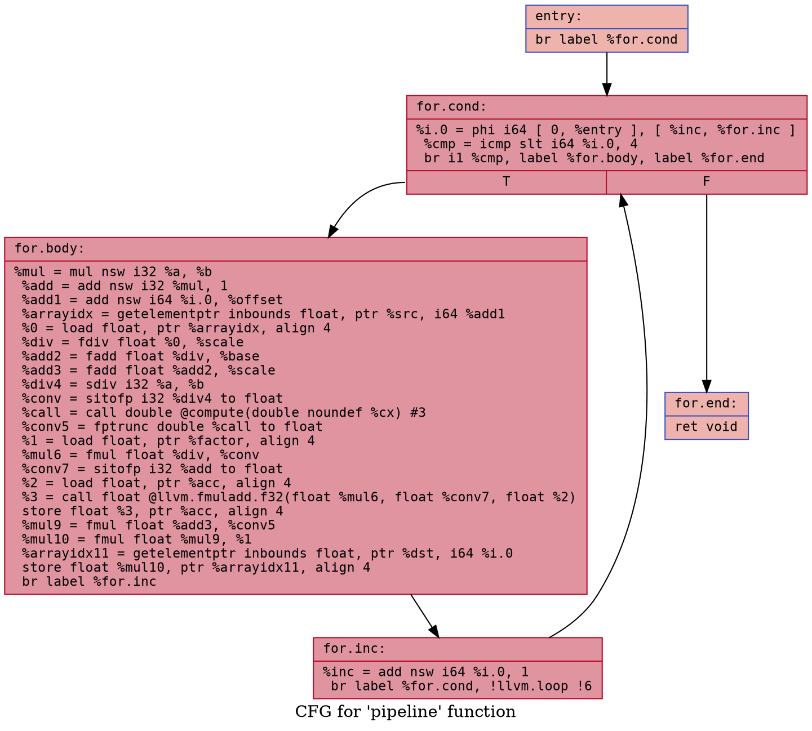
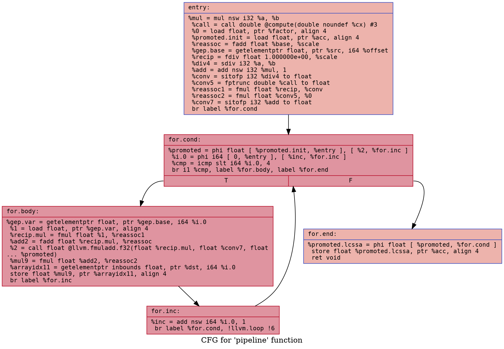

# LICM - Loop-Invariant Code Motion

Loop-Invariant Code Motion moves computations whose result doesn't change across iterations out of the loop body - hoisted to the preheader before the first iteration, or sunk to an exit block after the last. The pass operates on LLVM 18 IR using the new pass manager and drives four analyses: `DominatorTree`, `LoopInfo`, `AliasAnalysis`, and `ScalarEvolution`. It repeats until nothing moves - hoisting one instruction can expose the next.

---

## Combined Example

Transformations applied on one loop. TC = 4 gives SE the trip-count proof needed to unlock `sdiv` hoisting.

### Source

<table>
<tr><th>Before</th><th>After</th></tr>
<tr>
<td>
<pre><code class="language-c">double compute(double x) __attribute__((const));

void pipeline(
    float * __ restrict __ dst,
    const float * __ restrict __ src,
    float * __ restrict __ acc,
    long offset, float scale, float base,
    int a, int b, double cx,
    const float * __ restrict __ factor
) {
    for (long i = 0; i &lt; 4; i++) {
        int coeff = a * b + 1;
        float raw = src[i + offset];
        float normed = raw / scale;
        float adj = (normed + base) + scale;
        float q = (float)(a / b);
        float boost = (float)compute(cx);
        float f = *factor;
        *acc += normed * q * (float)coeff;
        dst[i] = adj * boost * f;
    }
}
</code></pre>
</td>
<td>
<pre><code class="language-c">void pipeline(...) {
    // preheader - all invariant work hoisted once
    <strong>int coeff = a * b + 1;</strong>                // core hoisting
    <strong>float recip = 1.0f / scale;</strong>           // reciprocal multiplication
    <strong>float adj_inv = base + scale;</strong>         // arithmetic reassociation
    <strong>int q_int = a / b;</strong>                    // SE-unlocked (TC=4)
    <strong>float boost = (float)compute(cx);</strong>     // call hoisting
    <strong>float f = *factor;</strong>                    // load hoisting
    <strong>float *src_b = src + offset;</strong>          // GEP reassociation
    <strong>float recip_q = recip * (float)q_int;</strong> // arith reassoc pair
    <strong>float boost_f = boost * f;</strong>            // arith reassoc pair
    <strong>float acc_reg = *acc;</strong>                 // memory promotion

    for (long i = 0; i &lt; 4; i++) {
        float normed = src_b[i] * recip_q;
        float adj    = normed + adj_inv;
        acc_reg     += normed * (float)coeff;
        dst[i]       = adj * boost_f;
    }

    <strong>*acc = acc_reg;</strong>                     // memory promotion
}
</code></pre>
</td>
</tr>
</table>

### IR

**Before** 

```diff
 entry:
   br label %for.cond

 for.cond:
   %i.0 = phi i64 [ 0, %entry ], [ %inc, %for.inc ]
   %cmp = icmp slt i64 %i.0, 4
   br i1 %cmp, label %for.body, label %for.end

 for.body:
-  %mul = mul nsw i32 %a, %b                                     // core hoist
-  %add = add nsw i32 %mul, 1                                    // core hoist
   %add1 = add nsw i64 %i.0, %offset
-  %arrayidx = getelementptr inbounds float, ptr %src, i64 %add1 // GEP reassoc
-  %0 = load float, ptr %arrayidx
-  %div = fdiv float %0, %scale                                  // reciprocal
   %add2 = fadd float %div, %base
-  %add3 = fadd float %add2, %scale                              // reassoc
-  %div4 = sdiv i32 %a, %b                                       // SE-unlocked
-  %conv = sitofp i32 %div4 to float                             // core hoist
-  %call = call double @compute(double %cx)                      // call hoist
-  %conv5 = fptrunc double %call to float                        // core hoist
-  %1 = load float, ptr %factor                                  // load hoist
-  %mul6 = fmul float %div, %conv                                // reassoc pair
-  %conv7 = sitofp i32 %add to float                             // core hoist
-  %2 = load float, ptr %acc                                     // promotion
   %3 = call float @llvm.fmuladd.f32(float %mul6, float %conv7, float %2)
   store float %3, ptr %acc
-  %mul9 = fmul float %add3, %conv5                              // reassoc pair
   %mul10 = fmul float %mul9, %1
   %arrayidx11 = getelementptr inbounds float, ptr %dst, i64 %i.0
   store float %mul10, ptr %arrayidx11
   br label %for.inc

 for.inc:
   %inc = add nsw i64 %i.0, 1
   br label %for.cond

 for.end:
   ret void
```

**After** 

```diff
 entry:
+  %mul = mul nsw i32 %a, %b                              // core hoist
+  %call = call double @compute(double %cx)               // call hoist
+  %0 = load float, ptr %factor                           // load hoist
+  %promoted.init = load float, ptr %acc                  // promotion
+  %reassoc = fadd float %base, %scale                    // reassoc
+  %gep.base = getelementptr float, ptr %src, i64 %offset // GEP reassoc
+  %recip = fdiv float 1.000000e+00, %scale               // reciprocal
+  %div4 = sdiv i32 %a, %b                                // SE-unlocked
+  %add = add nsw i32 %mul, 1                             // core hoist
+  %conv = sitofp i32 %div4 to float                      // core hoist
+  %conv5 = fptrunc double %call to float                 // core hoist
+  %reassoc1 = fmul float %recip, %conv                   // reassoc pair
+  %reassoc2 = fmul float %conv5, %0                      // reassoc pair
+  %conv7 = sitofp i32 %add to float                      // core hoist
   br label %for.cond

 for.cond:
+  %promoted = phi float [ %promoted.init, %entry ], [ %2, %for.inc ]
   %i.0 = phi i64 [ 0, %entry ], [ %inc, %for.inc ]
   %cmp = icmp slt i64 %i.0, 4
   br i1 %cmp, label %for.body, label %for.end

 for.body:
   %gep.var = getelementptr float, ptr %gep.base, i64 %i.0
   %1 = load float, ptr %gep.var
   %recip.mul = fmul float %1, %reassoc1
   %add2 = fadd float %recip.mul, %reassoc
   %2 = call float @llvm.fmuladd.f32(float %recip.mul, float %conv7, float %promoted)
   %mul9 = fmul float %add2, %reassoc2
   %arrayidx11 = getelementptr inbounds float, ptr %dst, i64 %i.0
   store float %mul9, ptr %arrayidx11
   br label %for.inc

 for.inc:
   %inc = add nsw i64 %i.0, 1
   br label %for.cond

 for.end:
+  %promoted.lcssa = phi float [ %promoted, %for.cond ]
+  store float %promoted.lcssa, ptr %acc
   ret void
```
</td>
</tr>
</table>

### CFG

| Before | After |
|--------|-------|
|  |  |

---

## Features

### Preheader Insertion

Every transformation hoists into the preheader, so it must exist. `ensurePreheader`:

- returns the existing preheader if the loop has one
- otherwise inserts a new empty block before the header (the header had multiple entry points - no single place to hoist into)

Runs first - every other transformation depends on it.

**Analyses:** `DominatorTree` · `LoopInfo`

---

### Core Hoisting

An instruction is hoisted only if all of the following hold:

1. not a terminator, PHI, load, store, or call - those are handled separately
2. every operand is strictly outside the loop right now (`L.isLoopInvariant` - not recursive, so X waits until its operand Y is physically hoisted first)
3. `isSafeToSpeculativelyExecute` passes, **or** the instruction's block dominates all loop exits - guaranteed to execute on every exit path

**Analyses:** `DominatorTree` · `LoopInfo`

<table>
<tr><th>Before</th><th>After</th></tr>
<tr>
<td>
<pre><code class="language-c">void transform(int *arr, int n,
               int a, int b, int c) {
    for (int i = 0; i &lt; n; i++) {
        arr[i] = (a * b + c) * i;
    }
}
</code></pre>
</td>
<td>
<pre><code class="language-c">void transform(int *arr, int n,
               int a, int b, int c) {
    <strong>int inv = a * b + c;</strong>
    for (int i = 0; i &lt; n; i++) {
        arr[i] = <strong>inv</strong> * i;
    }
}
</code></pre>
</td>
</tr>
</table>

---

### Load Hoisting

A load is hoisted only if all of the following hold:

1. not volatile - hardware registers and memory-mapped I/O can change without a store
2. not atomic - moving atomics changes the memory order visible to other threads
3. pointer operand is loop-invariant - if the address changes each iteration, we're reading different locations
4. no store in the loop `MayAlias` the load's address
5. no call in the loop writes to that location

**Analyses:** `AliasAnalysis` · `LoopInfo`

<table>
<tr><th>Before</th><th>After</th></tr>
<tr>
<td>
<pre><code class="language-c">void scale(int * __restrict__ arr, int n,
           const int * __restrict__ factor) {
    for (int i = 0; i &lt; n; i++) {
        arr[i] *= *factor;
    }
}
</code></pre>
</td>
<td>
<pre><code class="language-c">void scale(int * __restrict__ arr, int n,
           const int * __restrict__ factor) {
    <strong>int f = *factor;</strong>
    for (int i = 0; i &lt; n; i++) {
        arr[i] *= <strong>f</strong>;
    }
}
</code></pre>
</td>
</tr>
</table>

---

### Pure Call Hoisting

A call is hoisted only if all of the following hold:

1. named function (not a function pointer)
2. not inline asm
3. not convergent (no GPU thread synchronization)
4. `nounwind` - can't throw
5. `readonly` or `readnone` - doesn't write memory
6. all arguments loop-invariant
7. no store in the loop aliases memory the call reads
8. no other call in the loop writes to memory the call reads

**Analyses:** `AliasAnalysis` · `LoopInfo`

<table>
<tr><th>Before</th><th>After</th></tr>
<tr>
<td>
<pre><code class="language-c">double compute(double x) __attribute__((const));

void process(double *arr, int n, double x) {
    for (int i = 0; i &lt; n; i++) {
        arr[i] *= compute(x);
    }
}
</code></pre>
</td>
<td>
<pre><code class="language-c">void process(double *arr, int n, double x) {
    <strong>double cx = compute(x);</strong>
    for (int i = 0; i &lt; n; i++) {
        arr[i] *= <strong>cx</strong>;
    }
}
</code></pre>
</td>
</tr>
</table>

---

### Memory Promotion

Promotes a loop load/store pair on the same address to a register - one load before the loop, register arithmetic inside, one store after.

**Preconditions:**
1. single loop exit (known limitation - multiple exits would require a store at each)
2. exactly one store to this address in the loop
3. store block dominates the latch - store runs every iteration, PHI is never stale
4. no other store or call aliases this address

**What it creates:**
- preheader: `load` to initialize the register
- header: `PHI` to carry the value across iterations
- exit block: `store` to write the final value back once

**Analyses:** `AliasAnalysis` · `DominatorTree` · `LoopInfo`

<table>
<tr><th>Before</th><th>After</th></tr>
<tr>
<td>
<pre><code class="language-c">void accumulate(int * __restrict__ arr, int n,
                int * __restrict__ total) {
    for (int i = 0; i &lt; n; i++) {
        *total += arr[i];
    }
}
</code></pre>
</td>
<td>
<pre><code class="language-c">void accumulate(int * __restrict__ arr, int n,
                int * __restrict__ total) {
    <strong>int reg = *total;</strong>
    for (int i = 0; i &lt; n; i++) {
        <strong>reg</strong> += arr[i];
    }
    <strong>*total = reg;</strong>
}
</code></pre>
</td>
</tr>
</table>

---

### Arithmetic and GEP Reassociation

**Arithmetic reassociation** rewrites `(varying op inv1) op inv2` -> `varying op (inv1 op inv2)`:

- only for associative ops: `add`, `fadd`, `mul`, `fmul` (sub/div are not associative)
- combined invariant `inv1 op inv2` created once in the preheader
- regular hoisting misses this because the outer op has a variant operand

**GEP reassociation** splits `getelementptr base, (i + offset)` into two GEPs:

- preheader: `getelementptr base, offset` - advance base pointer once
- loop: `getelementptr result, i` - step only by the varying index

**Analyses:** `LoopInfo`

<table>
<tr><th>Before</th><th>After</th></tr>
<tr>
<td>
<pre><code class="language-c">// arithmetic
void process(float *arr, int n,
             float offset, float base) {
    for (int i = 0; i &lt; n; i++) {
        arr[i] = (arr[i] + offset) + base;
    }
}

// GEP
void copy(float *dst, float *src,
          long n, long offset) {
    for (long i = 0; i &lt; n; i++) {
        dst[i] = src[i + offset];
    }
}
</code></pre>
</td>
<td>
<pre><code class="language-c">// arithmetic
void process(float *arr, int n,
             float offset, float base) {
    <strong>float inv = offset + base;</strong>
    for (int i = 0; i &lt; n; i++) {
        arr[i] = arr[i] + <strong>inv</strong>;
    }
}

// GEP
void copy(float *dst, float *src,
          long n, long offset) {
    <strong>float *base = src + offset;</strong>
    for (long i = 0; i &lt; n; i++) {
        dst[i] = <strong>base</strong>[i];
    }
}
</code></pre>
</td>
</tr>
</table>

---

### Reciprocal Multiplication

Finds `fdiv x, invariant` in the loop and replaces it with a multiply:

- preheader: `recip = 1.0 / divisor` - one division for the whole loop
- loop: `fmul x, recip` - multiply instead of divide each iteration
- `fdiv` latency on x86: 10-20 cycles; `fmul`: 4-5 cycles
- integer `sdiv`/`udiv` not transformed - `x/c != x*(1/c)` under integer truncation

**Analyses:** `LoopInfo`

<table>
<tr><th>Before</th><th>After</th></tr>
<tr>
<td>
<pre><code class="language-c">void normalize(float * __restrict__ arr,
               int n, float scale) {
    for (int i = 0; i &lt; n; i++) {
        arr[i] = arr[i] / scale;
    }
}
</code></pre>
</td>
<td>
<pre><code class="language-c">void normalize(float * __restrict__ arr,
               int n, float scale) {
    <strong>float recip = 1.0f / scale;</strong>
    for (int i = 0; i &lt; n; i++) {
        arr[i] = arr[i] * <strong>recip</strong>;
    }
}
</code></pre>
</td>
</tr>
</table>

---

### Instruction Sinking

Moves instructions used only outside the loop to the exit block - executed once instead of n times.

**Preconditions:**
1. single loop exit
2. instruction has no memory side effects
3. all users are outside the loop
4. instruction's block dominates the exit - guaranteed to run on the last iteration (`trySink`), or SE proves TC > 0 + block dominates latch (`sinkSEUnlocked`)

**Analyses:** `DominatorTree` · `LoopInfo`

<table>
<tr><th>Before</th><th>After</th></tr>
<tr>
<td>
<pre><code class="language-c">int sink_demo(int n) {
    int i = 0, last;
    do {
        last = i * 7;
        i++;
    } while (i &lt; n);
    return last;
}
</code></pre>
</td>
<td>
<pre><code class="language-c">int sink_demo(int n) {
    int i = 0;
    do { i++; } while (i &lt; n);
    return <strong>(i - 1) * 7</strong>;
}
</code></pre>
</td>
</tr>
</table>

---

### SE-Unlocked Hoisting and Sinking

LLVM's standard LICM skips instructions that can crash on certain inputs - `sdiv`, loads from invalid pointers. There are two ways to prove it's safe to hoist them anyway, and both fail for for/while loops:

- `isSafeToSpeculativelyExecute` returns false for them
- the dominator fallback also fails - the loop body never dominates the exit when a **zero-trip path** exists (`header -> exit` without entering the body at all)

The fix: SE can answer "does this loop run at least once?" If `getSmallConstantTripCount` returns > 0, the body is guaranteed to execute - hoisting doesn't add a new execution, it just moves an existing one earlier.

```cpp
SE.getSmallConstantTripCount(&L) > 0  // loop runs at least once
DT.dominates(BB, Latch)               // block runs on every iteration
```

Runs after all other transformations so newly exposed invariants get a chance to be caught here too.

**Analyses:** `ScalarEvolution` · `DominatorTree`

<table>
<tr><th>Before</th><th>After</th></tr>
<tr>
<td>
<pre><code class="language-c">void scale(int * __restrict__ out,
           const int * __restrict__ in,
           int a, int b) {
    for (int i = 0; i &lt; 4; i++) {
        // sdiv: unsafe to speculate
        // body never dominates exit
        out[i] = in[i] * (a / b);
    }
}
</code></pre>
</td>
<td>
<pre><code class="language-c">void scale(int * __restrict__ out,
           const int * __restrict__ in,
           int a, int b) {
    <strong>int q = a / b;</strong>   // SE proves TC=4 - safe
    for (int i = 0; i &lt; 4; i++) {
        out[i] = in[i] * <strong>q</strong>;
    }
}
</code></pre>
</td>
</tr>
</table>

---

### LCSSA Maintenance

`formLCSSARecursively` runs once at the end, after the pass has finished moving instructions:

- hoisting and sinking move instructions out of the loop
- loop-internal SSA values used in exit blocks are left without a proper exit PHI
- LCSSA wraps each such value in a `phi [ %val, pred ]` at the exit
- required by downstream passes that assume LCSSA form
- runs after the do-while, not inside - PHIs created mid-loop would be invalidated by the next hoisting iteration

**Analyses:** `DominatorTree` · `LoopInfo` · `ScalarEvolution`

---

### Statistics and Debug

```bash
opt ... --stats           # instruction counts per transformation (requires LLVM debug build)
opt ... --debug-only=licm # per-decision trace (requires LLVM debug build)
```

`STATISTIC` counters: `NumHoisted`, `NumSunk`, `NumPromoted`, `NumSEHoisted`, `NumSESunk`. `LLVM_DEBUG` emits one line per hoisted/sunk instruction - both require LLVM built with assertions or `-DLLVM_FORCE_ENABLE_STATS`.

---

## Examples

[`examples/licm/`](../examples/licm/) - each subdirectory contains `original.ll`, `optimized.ll`, `original.png` (CFG before), `optimized.png` (CFG after). Run `visualize.sh` from the repo root to regenerate all of them.
